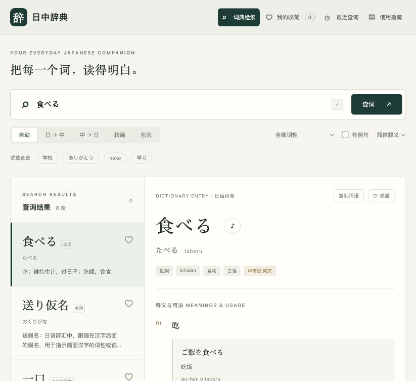

# 日中辞典 · Nichū Offline Dictionary

一部放在自己电脑里的日中词典。附带完整数据快照，下载后无需联网查词；Python 标准库运行，零第三方运行依赖。

**112,182 个不同词头 · 120,749 个可查询词条 · 147,559 个义项 · 12,492 条用例／引文**

数据来自中文维基词典的日语词条，经 Wiktextract / Kaikki.org 提取。源 dump 日期为 **2026-10-01**，提取日期为 **2026-10-02**。这里的“完整”指完整提供该快照的日语记录；不表示收录所有日语词语，也不表示每个词条都有读音、例句或音调。字段覆盖率和已知限制见 [数据说明](docs/DATA.md)。



## 快速开始

需要 **Python 3.10+** 和现代浏览器。Python 需预先安装；应用自身不需要 pip、npm、API Key 或账户。

```bash
git clone https://github.com/Hanbin-Zhang-JPN/nichu-offline-dictionary.git
cd nichu-offline-dictionary
python3 -m nichu.server
```

浏览器自动打开 **http://127.0.0.1:8765**。首次启动从附带的 10.9 MiB 压缩快照生成 SQLite 索引；这一步完全离线。终端出现“已启动”后即可使用。关闭服务按 `Ctrl+C`。

- **macOS**：也可双击 `start.command`；系统 Python 命令须为 `python3`。
- **Windows**：双击 `start.bat`，或在仓库目录运行 `py -3 -m nichu.server`。
- **Linux**：执行上述 `python3` 命令。
- **端口被占用**：`python3 -m nichu.server --port 8766`。
- **仅启动服务**：`python3 -m nichu.server --no-browser`。

也可从 [Releases](https://github.com/Hanbin-Zhang-JPN/nichu-offline-dictionary/releases) 下载 ZIP，解压后运行。发布包附带已经生成的索引；Git 仓库附带原始压缩快照，不提交体积较大的生成索引。

## 查词与学习

| 功能 | 说明 |
| --- | --- |
| 日语查询 | 汉字、平假名、片假名、全角／半角、已有读音生成的罗马字 |
| 中文反查 | 在中文释义中查找文字，简繁输入统一到简体检索 |
| 搜索模式 | 自动、日→中、中→日、精确、包含；精确命中优先 |
| 词形查询 | 索引源数据中的活用表、假名和罗马字；如 `食べた`、`たべた`、`tabeta` |
| 筛选与分页 | 按源词性筛选、仅看有结构化用例的词条；每页 30 条 |
| 详情 | 中文释义、读音、例句／引文及翻译、用法说明、IPA、源音调、语源、相关词和活用 |
| 中文显示 | 简体释义／源中文用字切换；日语词头、词形和例句保持原文 |
| 收藏与历史 | 浏览器本地保存；按 Enter 或打开词条记录历史，最多 100 条 |
| 学习记录备份 | JSON 导出和合并导入，无需账户或云同步 |
| 本地朗读 | 浏览器已有本地日语语音时启用；不使用在线音频或云端 TTS |
| 来源追溯 | 每个词条保留源链接和原始结构字段，来源链接需联网 |
| 命令行 | 与网页共用相同索引，可输出 JSON 或完整词条 |

按 `/` 快速聚焦搜索框。界面适配电脑与手机宽度。搜索和所有资源请求仅发送至本机服务；界面不加载 CDN、外部字体、统计脚本或广告。

例如：`学校` / `がっこう` / `gakkou` / `gakkō`；`猫` / `ねこ` / `neko`；中文反查 `学习` / `學習`。

收藏按浏览器和地址保存。更换端口、浏览器或清理站点数据会影响记录，建议定期导出。快照更新后，发生内容变化的词条 ID 也会改变，旧收藏可能需要重新查询。

## 命令行

```bash
python3 -m nichu 学校
python3 -m nichu gakkou --mode exact
python3 -m nichu 学习 --mode zh --limit 20 --json
python3 -m nichu --stats
python3 -m nichu --entry 2b3bce29ba9dfc3f896d279e --json
python3 -m nichu --entry 2b3bce29ba9dfc3f896d279e --original
```

## 数据与结构

```text
nichu/                  标准库后端、规范化、检索、CLI 与 HTTP 服务
web/                    无构建步骤的 HTML / CSS / JavaScript 界面
data/dictionary.jsonl.gz 全量日语源记录，离线可重建
data/manifest.json      来源、快照日期、SHA-256、归属与修改记录
data/stats.json         本次发布的可核对统计
data/TS*.txt            附带的 OpenCC 繁简映射表
scripts/import_source.py 从本地 Kaikki 原始 dump 提取所有 ja 记录
scripts/verify_data.py   校验快照、索引、计数和基本词条
scripts/package_release.py 生成带索引的离线 ZIP 与校验文件
tests/                  规范化、检索、原子构建、HTTP 与错误处理测试
docs/                   数据、架构、API 和发行说明
licenses/               数据和第三方许可证全文
.github/workflows/      跨平台测试和完整词库验证
```

更多细节：[数据说明](docs/DATA.md) · [架构](docs/ARCHITECTURE.md) · [本地 API](docs/API.md) · [贡献指南](CONTRIBUTING.md)。

## 验证与更新

```bash
python3 -m unittest discover -s tests -v
python3 scripts/verify_data.py
```

更新流程见 [数据说明](docs/DATA.md#更新数据)。正常使用不触发下载；导入脚本只处理你指定的本地文件。应用不会自动连接上游或静默更新词库。

## 许可与归属

- 应用代码与项目说明：**MIT**，见 [LICENSE](LICENSE)。
- 中文维基词典内容及派生索引：**CC BY-SA 4.0**，贡献者归属、来源、改动和再分发要求见 [DATA_LICENSE.md](DATA_LICENSE.md)。
- OpenCC 映射表：**Apache-2.0**，见 [licenses/OpenCC.txt](licenses/OpenCC.txt)。

感谢中文维基词典贡献者，以及 [Wiktextract](https://github.com/tatuylonen/wiktextract) / [Kaikki.org](https://kaikki.org/zhwiktionary/rawdata.html) 的数据提取工作。词典是社区编纂资料，部分旧条目保留源格式或重复文字；本项目不虚构缺失的释义、例句、JLPT 等级、词频和读音。
